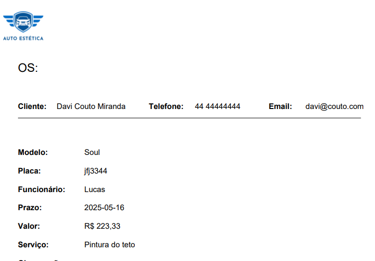

# Estetica AutoMotiva
Sistema para gestão de serviços de uma Estetica Automotiva desenvolvido com uso do framewrok Electron e do banco de dados MongoDB.

### Tela principal

### Cadastro de clientes

### Ordem de serviço

### Relatório de clientes

### Relatório de OS

### Relatório OS Pendentes

### Relatório OS Finalizadas

## Autor
Carlos Antonio 

## Pré-requisitos de instalação:
- Windows 10 ou superior
- Ter o banco de dados MongoDB instalado

### Instalação do MongoDB:
Acesse o site oficial:
[MongoDB](https://www.mongodb.com/try/download/community)

Baixe o MongoDB Community Server e instale com a opção de "Install MongoDB as a Service" ativada (instalação padrão).

Após instalar, ele inicia automaticamente.

### Instalação do sistema assisTI
Em releases faça o download da última versão (.exe) disponibilizada e execute no computador.
